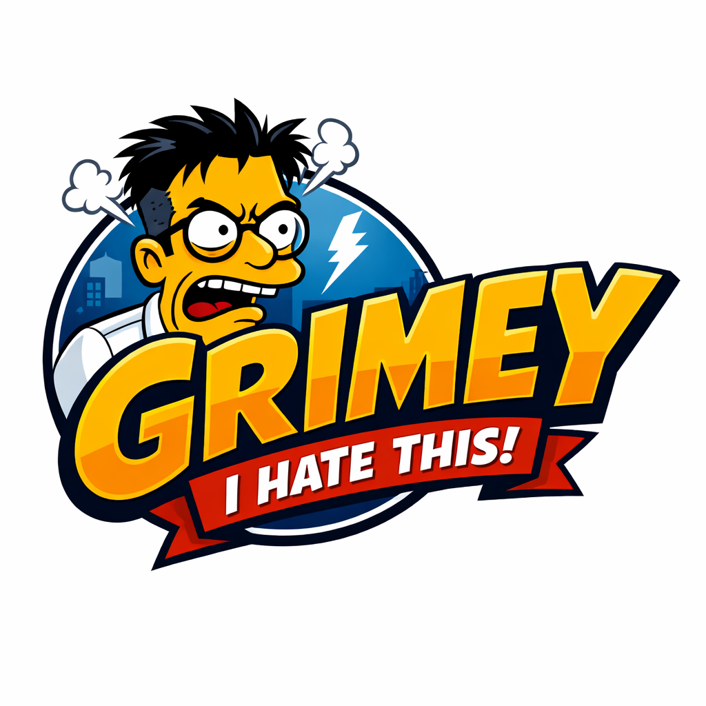

# Frank Grimes



> "I've had to work hard every day of my life, and what do I have to show for it? This briefcase, and this haircut."
> — Frank Grimes

A pessimistic iteration loop for systematically destroying, rebuilding, and hardening ideas. Named after Frank Grimes ("Grimey") from The Simpsons - the only character who actually *analyzed* what was wrong and refused to let it slide.

## Philosophy

**Everything is crap until proven otherwise.**

The Grimes Grind assumes your idea, code, plan, or design is:
- LLM slop
- Unreliable
- Insecure
- Poorly planned
- Not production-ready
- Unmaintainable

Your job is to prove these assumptions WRONG, not to prove the idea right.

## Installation

```
/plugin marketplace add misfitdev/claude-plugins
/plugin install frank-grimes@misfitdev/claude-plugins
```

## Commands

### `/frank-grimes:grind [target] [options]`

Start a Grimes Grind. If invoked without arguments, prompts interactively for scope, categories, and mode.

**Arguments:**
- `target` (optional): File path, directory, description, or "this". Skips the scope question.
- `--scope recent-changes|whole-repo` (optional): Shorthand scope. Skips the scope question.
- `--categories core-quality,security-privacy,architecture-ops,code-structure` (optional): Category groups to run. Default: all.
- `--mode fix|report` (optional): `fix` applies fixes automatically (default); `report` documents findings only.
- `--max-iterations N` (optional): Maximum iterations before stopping (default: 5)
- `--auto-loop` (optional): Enable automatic iteration until GREEN verdict. Still pauses for the redesign accept/reject prompt (Phase 4b).
- `--with-api-review` (optional): Enable Phase 2 API Correctness & Completeness review
- `--docs-review` (optional): Enable documentation & comments critique (grime-doc-*, grime-api-doc-*). Off by default; when off, absent docs are never penalized.
- `--no-artifact` (optional): Suppress the clickable web-artifact report. Published by default.

**Examples:**

```bash
# Interactive — prompts for scope, categories, and mode
/frank-grimes:grind

# One-shot grind on a file
/frank-grimes:grind ./src/auth.py

# Recent changes, report only
/frank-grimes:grind --scope recent-changes --mode report

# Grind with API review enabled
/frank-grimes:grind ./src/api --with-api-review

# Red team an architecture proposal
/frank-grimes:grind "The proposal to use MongoDB for our financial transaction system"
```

### `/frank-grimes:cancel`

Cancel an active Grimes Grind loop and report final status.

### `/frank-grimes:help`

Display help and usage information for the Grimes Grind plugin.

## How It Works

### The Grimes Grind Process

1. **Phase 1: The Grimey Read** - Understand what you're critiquing (max 3 clarifying questions)
2. **Phase 2: Default Assumptions** - Assume it's broken in every way
3. **Phase 3: The Grind** - Systematically attack across the enabled critique categories
4. **Phase 4: The Rebuild** - Propose fixes with regression scope (applied in `fix` mode)
5. **Phase 4b: Redesign Handling** - `grime-redesign-*` findings pause for an explicit accept/reject; accepted redesigns are re-ground (max 3 scoped iterations)
6. **Phase 5: Re-Grind (Scoped)** - Verify fixes didn't introduce new problems
7. **Phase 6: Stop Conditions** - Determine verdict
8. **Phase 7: API Quality Assessment** - Score API quality 0-100 (with `--with-api-review`)
9. **Phase 8: Report Artifact** - Publish the report as a clickable web artifact (unless `--no-artifact`)

### Verdicts

| Verdict | Meaning |
|---------|---------|
| 🟢 **GREEN** | All P0 mitigated, P1 planned, verification exists, observability sufficient |
| 🟡 **YELLOW** | P0 mitigated but P1 weak, partial verification, needs monitoring |
| 🔴 **RED** | P0 unmitigated, no verification, blocking issues remain |

### Auto-Loop Behavior

When `--auto-loop` is enabled:
1. The stop hook intercepts exit attempts
2. If verdict is not GREEN and iterations remain, the grind continues
3. State is persisted in `~/.cache/claude-plugins/frank-grimes/sessions/grimes-state.json`
4. Loop exits when GREEN or max iterations reached
5. The one intentional stop: the loop still blocks at the Phase 4b redesign accept/reject prompt — a reshaping is never applied without an explicit human accept

## Phase Structure

### Phase 1: Runtime Reliability & Production Blocking (Always Active)

Focuses on P0/P1 defects that would prevent production deployment:
- Syntax errors, compilation failures
- Unhandled errors in critical paths
- Resource leaks (timeouts, cleanup, OOM)
- Security issues (credentials, injection, auth)

**Verdict:** GREEN/YELLOW/RED based on blocking issues

**Output:** The Grimes Report (inline, plus a web artifact by default) with risk register and fixes, and a machine-readable `GRIMES_RESULT` JSON block for loop orchestration

---

### Phase 2: API Correctness & Completeness (Optional, --with-api-review)

Focuses on P1/P2 API quality issues:
- Package path correctness (`go_package`, Python imports)
- Feature completeness (no unfinished TODOs in production)
- Public interface documentation (godoc, docstrings)
- API consistency (error returns, naming patterns)
- Language best practices (no bare except, idiomatic code)

**Verdict:** API Quality Score (0-100) + categorized findings. Without `--docs-review`, the Documentation Coverage dimension is dropped and the score is normalized from 80 — absent docs are not penalized.

**Output:** Score breakdown and technical debt backlog, folded into the Grimes Report and web artifact

**When to use Phase 2:**
- After Phase 1 is GREEN (API quality doesn't block production)
- When scheduling technical debt sprints
- For comprehensive code quality assessment
- When handoff to different team requires API documentation

---

## Critique Categories

Categories are organized into selectable groups (`--categories`); all groups except Documentation are enabled by default:

| Group | Categories |
|-------|-----------|
| **Core Quality** | LLM Slop Check, Correctness, Reliability, Error Handling, Edge Cases, Code Quality & Formatting (grime-fmt-*), Maintainability, Existence Justification (grime-scope-*), Structural/Design (grime-struct-*), Better Design (grime-redesign-*) |
| **Security & Privacy** | Security, Input Validation (grime-val-*), Privacy & Data, Compliance, Safety/Security Theater (grime-thtr-*) |
| **Architecture & Ops** | Scalability, Observability, Testability, Deployment, Failure Modes, Cost, Human Factors |
| **Code Structure** | Code Duplication (grime-dup-*), Language-Specific Patterns (grime-lang-*), Configuration Management (grime-cfg-*), Resource Lifecycle (grime-res-*) |
| **Documentation** _(opt-in via `--docs-review`)_ | Documentation & Comments (grime-doc-*), Public Interface Documentation (grime-api-doc-*) |

Beyond "does it work?", four judgment-axis categories ask whether the code should exist, whether its guards mean anything, and whether it is shaped right:

- **Existence Justification (grime-scope-*):** validating a case with no real instances; speculative scaffolding
- **Safety/Security Theater (grime-thtr-*):** guards that cannot verify what they claim
- **Structural/Design (grime-struct-*):** works but shaped wrong
- **Better Design (grime-redesign-*):** a materially simpler approach exists — in `fix` mode this pauses for an explicit accept/reject, and accepted redesigns are re-ground with their blast radius

## Output: The Grimes Report

Every grind produces a structured report:

```markdown
## Grimes Grind Report: [Subject]

### Verdict: 🟢 GREEN | 🟡 YELLOW | 🔴 RED

**BLUF (Bottom Line Up Front):**
[One concise summary of the findings and the resulting level of confidence.]

**Top 3 Risks:**
1. ...
2. ...
3. ...

### Risk Register
| ID | Category | Risk Statement | Severity | Likelihood | Blast Radius | Evidence | Status |
...

### Can't Prove Wrong (Survived Scrutiny)
| Claim | Supporting Evidence | What Would Falsify It |
...

### Grimey's Final Word
[One brutal sentence of truth]
```

## Dependencies

- `jq` - Required for the stop hook to parse state JSON

Install on macOS: `brew install jq`
Install on Ubuntu: `apt-get install jq`

## Anti-Patterns

The skill warns against these failure modes:

- **Grimey Theater**: Going through motions without genuine skepticism
- **Optimism Creep**: "It'll probably be fine" - NO. Prove it.
- **Authority Deference**: "The LLM said so" - Verify anyway.
- **Perfection Paralysis**: Never shipping because something might be wrong
- **Orphaned Risks**: Accepted risks with no owner

## Credits

- Methodology inspired by pre-mortems, red teaming, and threat modeling
- Loop technique inspired by similar pessimistic iteration approaches
- Named after Frank Grimes from The Simpsons, S8E23 "Homer's Enemy"

---

*"You know what makes me mad? Not just that this is broken - it's that someone shipped it thinking it was fine. That's the real failure."*
— The Spirit of Grimey
